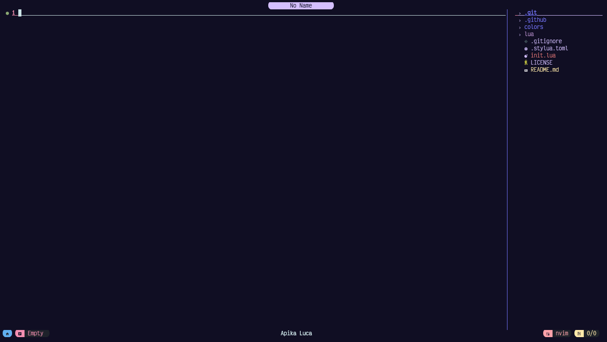

<h1 align="center">Apika's Config</h1>

    Fully customized Heavy fork of NvChad.

 

<!--  -->

## :gift_heart: Support

As this is a fork of NvChad, you can support them (NvChad's author links). 

## Credits

- [NvChad](https://github.com/NvChad)
- [Elianiva](https://github.com/elianiva) helped me with NeoVim Lua related issues many times, NvChad wouldn't exist without his help at all as he helped me in my initial neovim journey!
- @lorvethe for making the beautiful NvChad logo.
